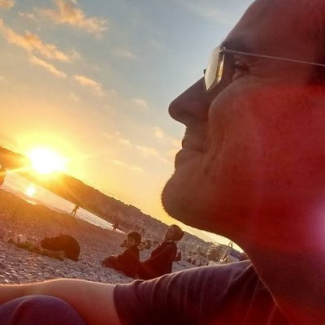

I am an **Insight Analyst** at [Etraveli](https://www.etraveli.com) in Uppsala, Sweden, and an **Affiliate Researcher** at the [Department of Linguistics and Philology](https://www.lingfil.uu.se/english/) of Uppsala University.

My research focuses on **computational historical linguistics**, particularly developing methods for analyzing the evolution of languages and text traditions. I specialize in phylogenetic methods that facilitate the use of phonological information in linguistic phylogenetics, from sound correspondences to inferences of sound changes.

In my current work, I have been extensively involved with **large language models in production environments**, both via APIs and locally deployed systems. I'm also working on computer versions of **Tafl games**, inspired by chess programming techniques.

I love programming, primarily using Python but also exploring R, Julia, Nim, and C. My Ph.D. thesis examined the classical as a means of relationship with otherness, as showcased by the literary development of Odysseus.

## Current Projects

- **PhyloVector**: Vector-based approaches to phylogenetic analysis
- **Uralic phylogeny**: Computational methods for Uralic language relationships  
- **Arawan family**: South American language family analysis
- **Tafl games**: Computer game programming with chess-inspired algorithms

## Recent Work

Check my [blog](/blog/) for thoughts on linguistics, data science, LLMs, and academic life, or explore my [research](/research/), [software](/software/), and [LLM work](/llm/) projects.
